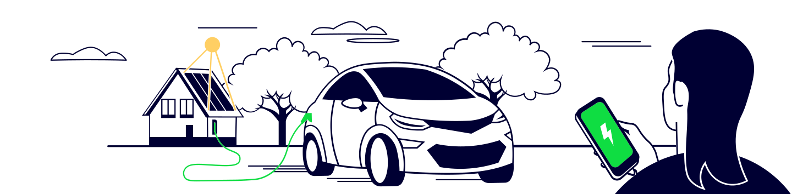
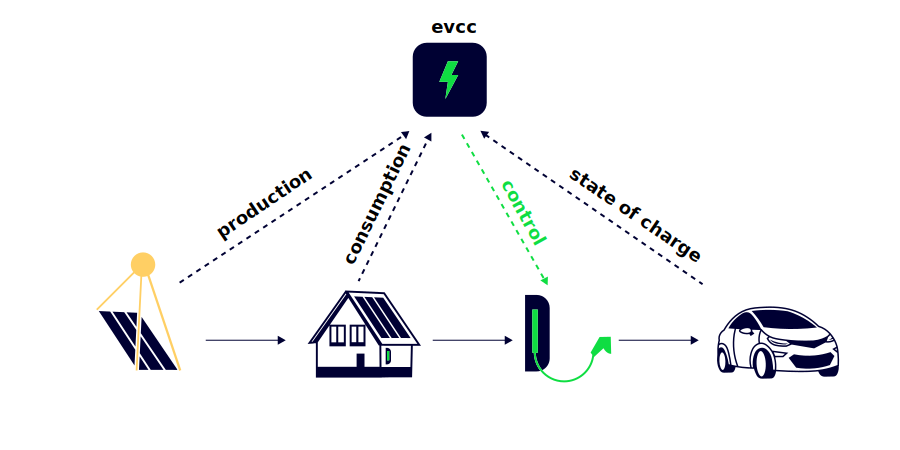

# Überschussladen - was ist das?

_**PV Überschussladen**_ bedeutet, dass der selbst erzeugte Strom aus einer Photovoltaikanlage zum Laden von Batterien oder Geräten verwendet wird, anstatt ihn ins Netz einzuspeisen, um so den Eigenverbrauch zu erhöhen.  
Wir reden hier natürlich primär von Elektroautos, aber genauso könnte man einen eScooter, ein eBike oder andere Geräte mit "Überschuss" laden.

## Was bedeutet "Überschuss"?

"That depends..." - aber ganz im Ernst, zunächst einmal ist "Überschuss" alles das, was man an PV-generiertem Strom gerade nicht im Haus verbraucht.  
Im Detail kann man noch den in der eventuell vorhandenen Hausbatterie vorhandenen, gespeicherten PV-Strom in den "Überschuss" mit einbeziehen - oder sogar den im Netz vorhandenen erneuerbar erzeugten Strom, wobei man hier dann von "_netzdienlichem Laden_" spricht, um die Energiewende zu unterstützen.  

Und wie stellt man fest, was gerade nicht verbraucht wird - bzw. andersherum, wie stellt man fest, was verbraucht wird, zieht das von der aktuellen PV Leistung ab, um dann festzustellen, ob etwas übrig bleibt?
Wie kann man bis zu einem bestimmten (Ent-)Ladestand die Hausbatterie mit einbeziehen?

### Sensoren und Messfühler

Damit das funktionieren kann, muss ein Steuerungssystem (egal welches)

1. Messen, was die PV gerade produziert
2. Messen, was im Haus verbraucht wird  
_(faktisch wird das erreicht, indem einfach die Einspeisung ins Netz gemessen wird)_
3. (optional) Den Ladestand der Hausbatterie messen
4. Die Wallbox steuern können

Wenn man eine PV Anlage hat, sollte der Wechselrichter mindestens Daten über die erzeugte Leistung bereitstellen, viele haben zusätzlich auch eine Messeinrichtung, welche die Einspeisung ins Netz (und damit den Verbrauch im Haus) am Eingang des "Sicherungskastens" bzw. am Hausanschluss misst. 

### Steuerbare Wallbox

Jetzt benötigt man noch eine Wallbox, die in der Ladeleistung gesteuert werden kann. Warum? 
Eine "dumme" Wallbox, die nur an/aus kann, wird immer mit dem Maximum laden, weil sie ja dafür gebaut ist - 11 bzw 22kW bei typischen drei-phasigen ("Drehstrom") Wallboxen bzw 3,6/7,2kW bei einphasigen Wallboxen.

Aber soviel Leistung muss man erstmal übrig haben (wir reden ja von "**Überschuss**-Laden") - bei kleineren PV-Anlagen oder im Winter / an bedeckten Tagen wird ohne eine Steuerung immer Strom aus dem Netz bezogen werden (müssen), wenn die Wallbox nicht steuerbar ist.
Zum Glück sind die meisten heute erhältlichen Wallboxen auf die eine oder andere Art steuerbar.

:::note

Nur der Vollständigkeit halber: Die allereinfachste Methode ist natürlich der Eiweiß-Computer... mit anderen Worten, man beobachtet die PV Erzeugung und steuert _selbst und manuell_, dass man nur bei ausreichend Sonne lädt, wenn man nicht gleichzeitig kocht, die Waschmaschine läuft, usw. und startet/stoppt das Laden dementsprechend am Auto oder der Wallbox.  
Aber - wer will das schon?

:::

## Proprietäre (Hersteller-eigene) Lösungen

Viele am Markt erhältliche Lösungen arbeiten nur mit Komponenten desselben Herstellers oder wenigen kompatiblen zusammen (Wallbox und Wechselrichter, ggf. Batterie müssen vom gleichen Hersteller sein) oder aber sind sehr teuer, da sie durch zusätzliche Komponenten ergänzt werden müssen.  
Ein Beispiel dafür sind "smarte Wallboxen" bzw. Wallboxen, die speziell auf Überschussladen ausgelegt sind.  
Auch diese müssen den Verbrauch und die Erzeugung messen können - und werden daher meist als Paket mit Messfühlern und einer Sendeeinheit verkauft. Diese stellt dann die Messdaten im Haus-LAN/WLAN oder über ein eigenes WLAN zwischen Wallbox und Messfühler/Sendeeinheit der Wallbox zur Verfügung.  
Diese zusätzlichen Komponenten machen eine solche Wallbox deutlich teurer - obwohl oft schon alle (oder zumindest die meisten) Daten zur Verfügung stehen.

## Open Source - evcc 

Hier kommt evcc ins Spiel: Wir sind keine Freunde von **geschlossenen Ökosystemen, Clouddiensten** und **teuren Energiemanagementsystemen**.  
evcc ist eine lokale Lösung, die auf deiner eigenen Hardware läuft und deine Geräte intelligent zusammenspielen lässt - _**egal von welchem Hersteller**_.

Bereits heute werden zahlreiche Hersteller von Wallboxen unterstützt, und evcc ermöglicht es, die Stromstärke zu steuern, mit der das Auto geladen wird. Das heißt, wenn viel Sonnenstrom erzeugt wird, erlaubt evcc, das angeschlossene Auto mit hoher Leistung zu laden. Wird weniger Strom erzeugt, verlangsamt oder pausiert evcc den Ladevorgang.

Damit evcc die Ladung bestmöglich regeln kann, ist ein Messgerät (= auslesbarer Energiezähler) am Netzanschluss der Hausinstallation notwendig. Durch dieses Messgerät kennt evcc den momentanen Energieüberschuss und kann die Ladeleistung kontinuierlich anpassen. Das Gute ist, dass in fast jeder vorhandenen PV-Anlage ein entsprechendes Gerät bereits vorhanden ist oder einfach nachgerüstet werden kann.

Ist ein von evcc unterstütztes Elektrofahrzeug eingerichtet, kann sein momentaner Batterieladezustand und die Reichweite angezeigt und in der Ladeplanung berücksichtigt werden. Auch wenn die Sonne ab und an mal nicht so viel scheint, bleibt so die Mobilität sichergestellt.

Und noch etwas kann evcc: Ist ein unterstützter Batteriespeicher vorhanden, wird auch dessen Ladezustand gesteuert und mit Sonnenstrom versorgt.

