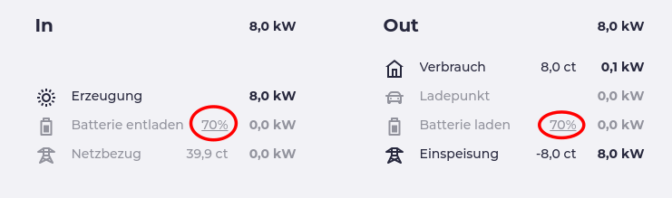
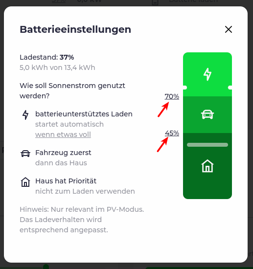
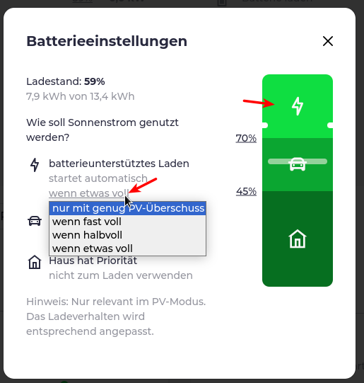

import SponsorshipRequired from "/docs/_sponsorship_required.mdx";

# Die Lademodi

Was bedeuten die unterschiedlichen Lademodi und welche Auswirkungen haben diese?

  

### Aus
Der Ladevorgang wird _sofort_ beendet bzw. kann nicht beginnen.
:::tip

Das kann man prima nutzen, um einen Ladevorgang zu beenden bzw. die Wallbox zu sperren, ohne eine Wallbox-App zu bemühen oder an die Wallbox / das Auto gehen zu müssen, um den Ladevorgang zu beenden bzw. die Wallbox "abzuschliessen".

:::

### Schnell
Es wird _sofort_ mit der maximal möglichen Leistung geladen - ohne Rücksicht auf erforderlichen Netzbezug oder Hausbatterieentladung, um die erforderliche Ladeleistung zu erreichen.

### Min+PV
Es wird _sofort_ mit der technisch _kleinstmöglichen_ Leistung geladen. Liegt diese kleinstmögliche Leistung oberhalb des gerade zur Verfügung stehenden PV Überschuss, wird die Hausbatterie entladen bzw. auf Netzbezug zurückgegriffen, um diese minimale Leistung zu erreichen.  
Sofern die PV Installation genug Überschuss für eine höhere Leistung hat, wird die Leistung erhöht.

:::info

Die technisch kleinstmögliche Leistung richtet sich nach der installierten Wallbox. 
Bei einer einphasigen Wallbox (1P) wird dies typischerweise 6A \* 230V = 1380 VA = 1.38 kW (also ca. 1.4 kW)  
Bei einer dreiphasigen Wallbox (3P) dementsprechend 3 \* 6A \* 230V = 4140 VA = 4.14 kW (also ca. 4.2 kW)  
Wallboxen mit einer dynamischen 1P/3P Umschaltung entsprechend auch ca. 1.4 kW  
Für die 1P/3P Umschaltung bei unterstützten Wallboxen ist ein 
<SponsorshipRequired />

:::

### PV
Der Ladevorgang wird _abhängig_ von der PV Installation zur Verfügung gestellten Leistung gestartet, sofern technisch möglich. 

Generell gilt im Modus PV:

- Der Ladevorgang wird immer nur dann gestartet, wenn über eine definierte Dauer ([Standard: 1 Minute](/docs/reference/configuration/loadpoints#enable)) der benötigte PV Überschuß vorhanden ist.
- Der Ladevorgang wird immer unterbrochen, wenn über eine definierte Dauer ([Standard: 3 Minuten](/docs/reference/configuration/loadpoints#disable)) nicht genügend Strom für eine Mindestleistung (s.o. Infobox "_technisch kleinstmögliche Leistung_") vorhanden ist.

:::tip

Sollte die Ladung im Modus PV unterbrochen werden, obwohl _eigentlich_ die Sonne scheint, einfach kurz auf den Hausverbrauch schauen, denn Überschuss bedeutet: PV Leistung - Hausverbrauch = zur Verfügung stehende Leistung.  
Vielleicht hat gerade jemand im Haus Waschmaschine & Trockner angestellt und mit dem Kochen & Backen angefangen? :wink:

:::

#### Ohne Hausbatterie

Im Falle einer PV _ohne_ Hausbatterie bedeutet dies, dass mindestens die technisch kleinstmögliche Leistung (s.o.) _als Überschuss_ zur Verfügung stehen muss, damit der Ladevorgang startet bzw. nicht angehalten wird.

#### Mit Hausbatterie

Steht eine Batterie zur Verfügung, wird im Modus PV diese unter bestimmten Voraussetzungen mit einbezogen:

*1. Vorrang Hausbatterie*  
Es kann ein Ladestand der Hausbatterie definiert werden, bis zu diesem die Hausbatterie Vorrang hat - ein Ladevorgang wird nicht gestartet, solange die Batterie diesen Stand nicht erreicht hat (bzw. unterbrochen, wenn sie unter diesen Stand fällt).

*2. Vorrang Auto*  
Ist die Hausbatterie ausreichend geladen (siehe 1) wird dem Auto Vorrang gewährt, d.h. der gesamte vorhandene Überschuss wird ins Auto geladen. Ist kein Überschuß vorhanden, wird nicht geladen bzw. nach obigen Regeln abgebrochen.

*3. Batterieunterstütztes Laden*  
Oberhalb des Ladestandes 2 (Vorrang Auto) kann ein Ladestand definiert werden, ab dem (oder bis zu dem, je nachdem ob man von "unten" oder von "oben" kommt) die Batterie als "Überschuss" gewertet wird und das Laden unterstützt, wenn die _technisch kleinstmögliche_ Leistung nicht als "echter" PV Überschuss zur Verfügung steht.

*4. Automatischer Start des batterieunterstützten Ladens*  
Oberhalb der "Freigabe" die Batterie mitzubenutzen (Punkt 3), kann ein Ladestand definiert werden, ab dem das automatisch passiert. Sobald also dieser Ladestand überschritten wird, startet das Laden und das Auto lädt mit Unterstützung der Batterie - so lange, bis diese den "Freigabestand" unterschreitet. Danach lädt das Auto nur noch (wir sind jetzt im Bereich "Vorrang Auto") wenn genug PV Überschuss vorhanden ist. 

:::info

Ein typischer Anwendungsfall für so etwas ist eine kleine PV (oder der Winter / widrige Verhältnisse):  
Ich habe keinen Zeitdruck beim Laden, möchte aber sicherstellen, dass ich mit einer ausreichend geladenen Hausbatterie in die Nachtstunden gehe. (Vorrang Hausbatterie).

Ein zweiter Anwendungsfall (ggf. kombiniert mit dem obigen) - ich habe eine 3P Wallbox, die ich nicht umschalten kann (keine automatische oder manuelle Möglichkeit von 3P auf 1P umzuschalten).  
Damit liegt die Mindestladeleistung bei ca. 4.2 kW, die ich aber mit einer kleinen PV oder bei schlechtem Wetter nur selten erreiche, egal ob ich dem Auto nun Vorrang gebe oder nicht.    
Also stelle ich das batterieunterstützte Laden herunter (z.B. auf 50%, wenn ich 50% Batterie für die Nacht brauche), lasse die Hausbatterie erstmal Leistung von der PV "aufsammeln", um sie dann automatisch mit 4.2 kW (3P) ins Auto zu schicken. Das hält dann wieder an, sobald 3.) unterschritten wird, sie sammelt wieder auf, usw. usf. 

:::

## Batterieeinstellungen

Die oben erwähnten Batterieeinstellungen erreicht man bei Klick auf den Batterieladestand (der Hausbatterie):

  

Hier kann man nun mit Klick auf die Zahlen die benötigten Werte einstellen.

 

Den Wert, ab dem das batterieunterstützte Laden automatische beginnt, setzt man mit Klick auf den Text oder auf das "Blitz" Symbol.

 