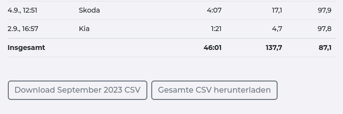

# Das UI

Auch wenn die Benutzeroberfläche (das UI) sehr übersichtlich und intuitiv aufgebaut ist, findest Du hier einen kurzen Überblick über die wichtigsten Komponenten:

## Übersicht

Hier findet man einen Überblick über  
- "**In**":  d.h. was evcc als Bezug sieht (entweder aus der PV, aus dem Netz oder aus einer evtl. vorhandenen Hausbatterie). PV Bezug und Bezug aus der Hausbatterie werden grün dargestellt (es handelt sich ja um unsere grüne Energie), Netzbezug schwarz.
und
- "**Out**": d.h. was evcc als Verbrauch sieht (im Haus, von der Wallbox oder als Netzeinspeisung). Netzeinspeisung wird als gelb dargestellt, da ja das Ziel von evcc ist, den Eigenverbrauch durch intelligent gesteuertes Laden zu erhöhen. 

Ein Klick auf den Balken blendet die Details ein und aus, was auf einem Handy recht praktisch sein kann.

## Ladepunkt 

Unterhalb der Übersicht findet sich der Ladepunkt - in diesem Beispiel ganz kreativ "Wallbox" genannt: 
:::note

Den Ladepunkt kann man in der [Konfiguration](/docs/reference/configuration/loadpoints.md) bzw. bei der [Erstinstallation](/docs/installation/) mit `evcc configure` nennen, wie man möchte - oder wenn man mehrere hat, wie "Carport" und "Garage" o.ä.) 

:::

 

Neben Statusinformationen über den aktuellen Ladevorgang kann man hier 
1. den Lademodus einstellen (auch während eines Ladevorganges)
2. das Fahrzeug aus seiner [Fahrzeugliste](/docs/devices/vehicles.mdx) selektieren oder ändern, falls es nicht korrekt automatisch erkannt worden sein sollte
3. neben der Restzeit auch noch andere Ansichten einstellen (bisherige Ladedauer, Sonnenanteil, etc.)
 
4. das Ladeziel entweder per Slider oder mit Klick auf die Zahl angeben
5. einen Ladeplan definieren

## Diverse UI Features

### Ladehistorie

Ganz oben in der Titelzeile findet sich ein Menü, in dem man Zugriff auf eine Historie seiner Ladevorgänge hat (diese werden lokal in der evcc Datenbank gespeichert und nirgendwohin hochgeladen):

 

Man kann diese sortieren und filtern

 

oder aber als CSV herunterladen, um die Daten dann woanders zu massieren ;-) 

### Einstellungen

Aus dem Menü oben hat man auch Zugriff auf diverse Einstellungen:

 

### Experimentelle UI Features

evcc ist Open Source und wird durch das [Core Team](https://github.com/orgs/evcc-io/people) und die [Community](https://github.com/evcc-io/evcc/discussions) ständig weiterentwickelt. 

Neue UI-Features werden "zum Ausprobieren" erstmal nur freigeschaltet, wenn man bei den Einstellungen den Schalter "Experimentell" umlegt.  
Ein aktuelles Beispiel sind die Ladestrom Einstellungen - nur sichtbar im "experimentellen" Modus:

 

 

### Warnungen und Fehler

Sollten irgendwo Probleme auftreten, muss man nicht sofort das [`log`](/docs/reference/configuration/log#log) bemühen - diese werden auch in der Titelzeile angezeigt:
  

Mit einem Klick gelangt an in eine Auflistung, was wann passiert ist und kann diese dann auch entfernen.

  
