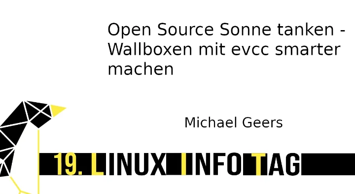
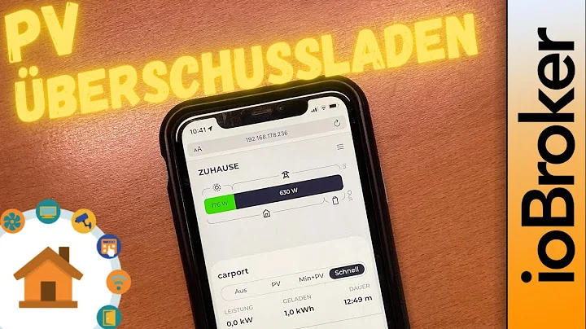
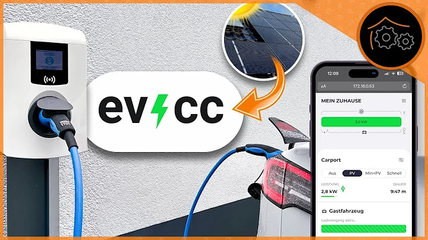

# Videos

## Vortrag Augsburger Linux Infotag 2023

[Michael](https://github.com/naltatis) stellt das Projekt vor, erzählt was zum Arbeitsalltag und zur Finanzierung des Projekts.

## verdrahtet: PV Überschussladen mit evcc

Behandelt die Themen evcc Einrichtung und Grundlagen, Integration mit ioBroker und die Einbindung eines Homematic Schalters.

## haus-automatisierung.com: PV-Überschuss ins E-Auto laden

Behandelt die Themen evcc Einrichtung, Grundlagen und Custom Plugins, Steuerung über MQTT und ioBroker, unterschiedliche Installationsmöglichkeiten.

